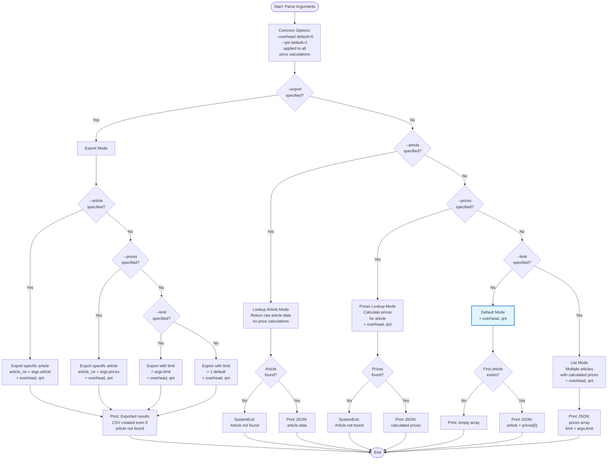

# CLI Logic Documentation

This document describes the behavior of `main.py` based on command-line arguments.

## Decision Flowchart



## Detailed Behavior

### Export Mode (`--export` specified)

1. **If `--article` is specified:**
   - Export only the specified article
   - `export_prices_to_csv(..., article_no=args.article, overhead_percent=args.overhead, quantity=args.quantity)`
   - CSV is created even if article is not found (empty CSV with headers)

2. **Else if `--prices` is specified:**
   - Export only the specified article (same as `--article`)
   - `export_prices_to_csv(..., article_no=args.prices, overhead_percent=args.overhead, quantity=args.quantity)`
   - CSV is created even if article is not found (empty CSV with headers)

3. **Else (if `--limit` is specified or not):**
   - Export with limit
   - `export_prices_to_csv(..., limit=args.limit, overhead_percent=args.overhead, quantity=args.quantity)`
   - If `--limit` is not specified, default `limit=1` (first article only)
   - Use `--limit all` or `--limit None` for unlimited export

### Article Lookup Mode (`--article` specified, no `--export`)

- Lookup raw article data (no price calculations)
- Options `--overhead` and `--qnt` are not used (no price calculations)
- If article not found → `SystemExit` with error message
- If found → Print JSON with article data

### Prices Lookup Mode (`--prices` specified, no `--export`)

- Calculate prices for specific article
- Uses `--overhead` and `--qnt` options for price calculations
- If article not found → `SystemExit` with error message
- If found → Print JSON with calculated prices array

### Default Mode (`--limit` not specified or `--limit == 1`, no other flags)

- Get first article from database
- Uses `--overhead` and `--qnt` options for price calculations
- If no articles → Print `[]`
- If found → Print JSON with:
  - `article`: raw article data
  - `prices`: first element from calculated prices (or `None`)

### List Mode (`--limit` specified and `!= 1`, no other flags)

- Calculate prices for multiple articles
- Uses `--overhead` and `--qnt` options for price calculations
- Print JSON array with calculated prices
- Number of articles = `args.limit` (or unlimited if `--limit all` or `--limit None`)

## Common Options

- `--overhead <float>`: Overhead percentage (default: 0.0)
  - Applied to all price calculations (Export, Prices Lookup, Default, List modes)
  - Not used in Article Lookup mode (no price calculations)

- `--qnt <float>`: Quantity for price calculation (default: 1.0 if not specified)
  - Uses graduated prices if available
  - Applied to all price calculations (Export, Prices Lookup, Default, List modes)
  - Not used in Article Lookup mode (no price calculations)

- `--limit <int|all|None>`: Limit number of articles (default: 1)
  - Used in Export mode and List mode
  - In Default mode, `--limit` is not specified or equals 1

## Examples

```bash
# Export first article
python main.py --export output.csv

# Export all articles
python main.py --export output.csv --limit all

# Export specific article
python main.py --export output.csv --article 2TOP

# Lookup raw article data
python main.py --article 2TOP

# Calculate prices for specific article
python main.py --prices 2TOP --qnt 100

# Default: first article with prices
python main.py

# List first 10 articles with prices
python main.py --limit 10

# List all articles with prices
python main.py --limit all
```

## Edge Cases and Error Handling

### Article Not Found

**Behavior differs by mode:**

1. **Article Lookup Mode (`--article`):**
   ```bash
   python main.py --article NONEXISTENT
   # Output: SystemExit with error message
   # Error: "Article NONEXISTENT not found"
   ```

2. **Prices Lookup Mode (`--prices`):**
   ```bash
   python main.py --prices NONEXISTENT
   # Output: SystemExit with error message
   # Error: "Article NONEXISTENT not found"
   ```

3. **Export Mode (`--export`):**
   ```bash
   python main.py --export output.csv --article NONEXISTENT
   # Output: CSV file is created with headers only (no data rows)
   # Message: "Exported results to output.csv"
   # No error is raised - export succeeds with empty result
   ```

### Empty Database

**When no articles exist in the database:**

1. **Default Mode:**
   ```bash
   python main.py
   # Output: []
   # (Empty JSON array)
   ```

2. **List Mode:**
   ```bash
   python main.py --limit 10
   # Output: []
   # (Empty JSON array)
   ```

3. **Export Mode:**
   ```bash
   python main.py --export output.csv
   # Output: CSV file created with headers only
   # Message: "Exported results to output.csv"
   ```

4. **Article/Prices Lookup:**
   ```bash
   python main.py --article ANY
   # Output: SystemExit with error
   # Error: "Article ANY not found"
   ```

### Combining Options

**Valid combinations:**

- `--export --article --overhead --qnt`: Export specific article with overhead and quantity
- `--prices --overhead --qnt`: Calculate prices with overhead and quantity
- `--limit --overhead --qnt`: List multiple articles with overhead and quantity

**Options that don't apply:**

- `--article` mode: `--overhead` and `--qnt` are ignored (no price calculations)
- `--export --article` and `--export --prices`: Both work the same way (export specific article)

**Example of combining options:**
```bash
# Export specific article with overhead 10% and quantity 100
python main.py --export output.csv --article 2TOP --overhead 10.0 --qnt 100

# Calculate prices for article with overhead 5% and quantity 50
python main.py --prices 2TOP --overhead 5.0 --qnt 50

# List first 5 articles with overhead 15% and quantity 200
python main.py --limit 5 --overhead 15.0 --qnt 200
```

### Limit Parameter Edge Cases

**Special limit values:**

- `--limit 1` or no `--limit`: Default mode (first article with both article info and prices)
- `--limit 0`: Returns empty array `[]`
- `--limit all` or `--limit None`: Unlimited (all articles)
- `--limit 10`: List mode (first 10 articles with calculated prices only)

**Example:**
```bash
python main.py --limit 0
# Output: []

python main.py --limit all
# Output: [array of all articles with calculated prices]
```

### Export Mode Behavior

**Export always succeeds, even with no data:**

- If article not found → CSV with headers only
- If database is empty → CSV with headers only
- If limit is 0 → CSV with headers only
- Output folder is created automatically if it doesn't exist

**Example:**
```bash
# Export non-existent article
python main.py --export output.csv --article NONEXISTENT
# Creates: output.csv with headers, no data rows
# No error raised

# Export with limit 0
python main.py --export output.csv --limit 0
# Creates: output.csv with headers, no data rows
```

